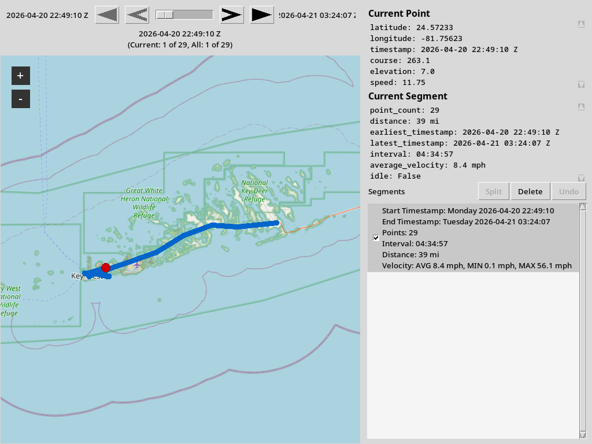
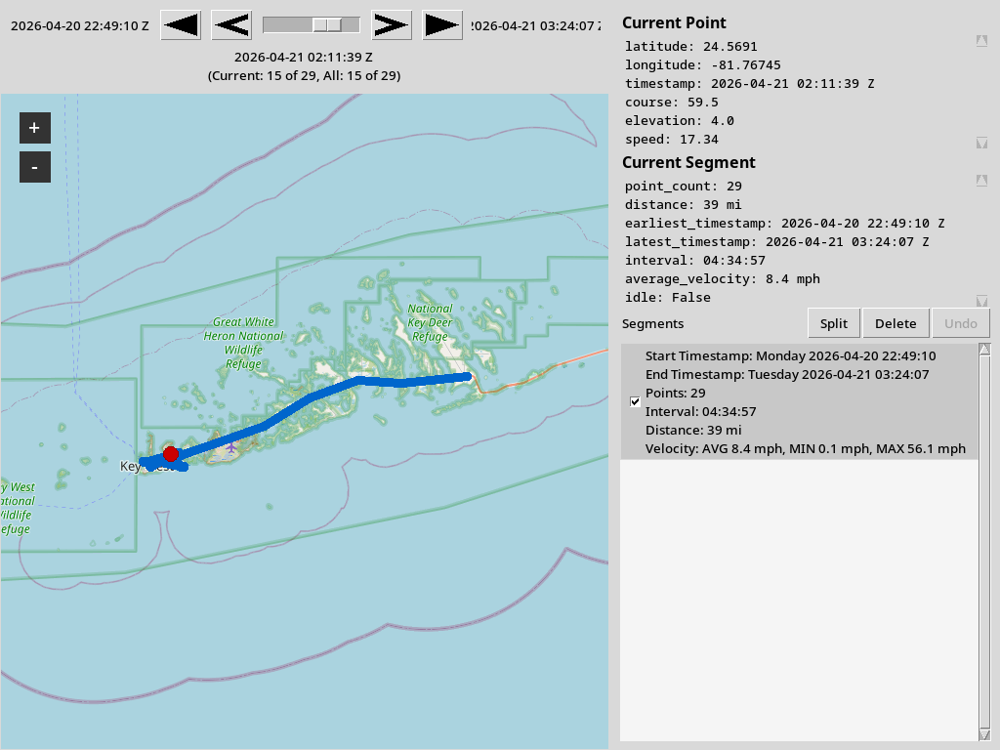
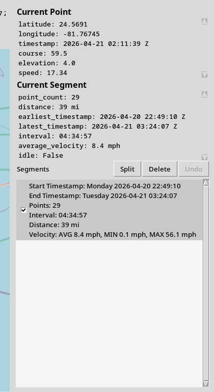
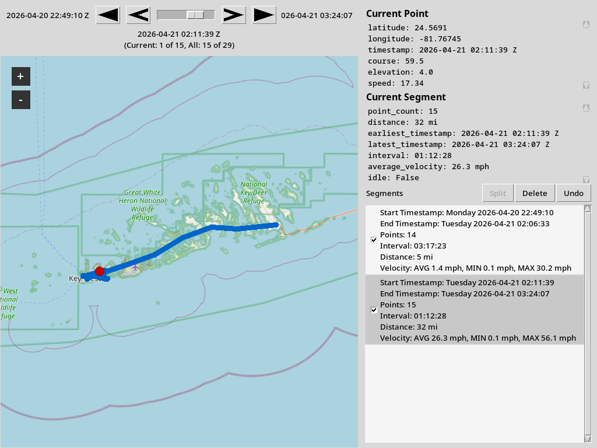
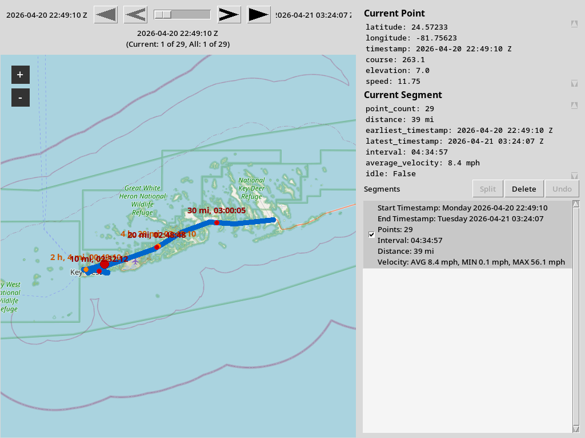
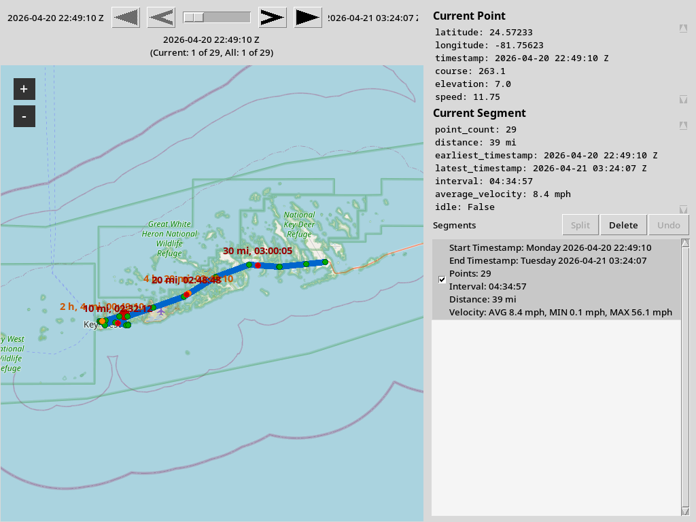

# Features

Complete catalog of GIS Graphical Editor (`gge`) capabilities, including map display, time-slider animation, segment splitting and deletion, metadata panels, and optional point and interval overlays.



## Application shell

- **Desktop GUI** built with Tkinter and [tkintermapview](https://github.com/TomSchimansky/TkinterMapView).
- **Default window** size 1024×768 with title "GIS Graphical Editor".
- **Console entry point** `gge` (package name `gge`, import path `gis_graphical_editor`).
- **Lazy map creation**: the map widget is created only after a GPX file is successfully loaded; closing the track destroys the widget.

## GPX loading

- **File dialog load** via **File → Load** (Ctrl+O) or startup prompt when no GPX filepath positional argument is given.
- **Startup load** via optional positional `PATH` argument without opening the dialog first.
- **`--ref-segment-name`**: draws rotated trkseg extension labels on the map (for example `circuit.lap.label` on Circuit GPX files).
- **Supported geometry sources** (first non-empty wins):
  - Track segment points, in file order across all tracks and segments.
  - Route points when the file has no track segments.
  - Standalone waypoints when tracks and routes are absent.
- **Point model** (`GpxPointRecord`): latitude, longitude, and optional timestamp per point.
- **Timestamp normalization**: timezone-aware GPX timestamps are converted to naive datetimes for analysis.
- **`--as-timezone IANA_NAME`**: convert all loaded timestamps to the named IANA zone for display; warns when naive timestamps are interpreted as UTC first.
- **Error feedback**:
  - Error dialog when the path is not a file.
  - Error dialog when the GPX cannot be parsed.
  - Warning dialog when no track points are found.
  - Warning when `--mark-hours` is set but the loaded GPX has no timestamps (hour markers are skipped; the path still draws).
  - Warning when the GPX has no timestamps (the time slider, metadata panel, and segment list are not shown).

## Map display


- **Base map**: OpenStreetMap tiles through tkintermapview.
- **Track path**: blue polyline (`#0066CC`, width 9) through all loaded coordinates.
- **Auto framing**: after each load, the map fits a bounding box around the track (max/min latitude and longitude).
- **Double-click zoom**: double-clicking the map canvas increases zoom by one level, centered on the click position.
- **Ctrl+click zoom out**: Ctrl+clicking the map canvas decreases zoom by one level, centered on the click position (does not start a pan).
- **Close track**: **File → Close** (Ctrl+W) clears paths, markers, and removes the map widget. The menu item is disabled until a track is loaded.

## Time slider and track animation



- **Requires timestamps** on the loaded GPX; omitted when the file has no timed points.
- **Horizontal slider** above the map spanning earliest to latest track timestamp, with endpoint labels showing date, time, and timezone when available.
- **Current position label** under the slider shows the selected timestamp plus point index within the current segment and across all visible timed points, e.g. `(Current: 1 of 29, All: 1 of 29)`.
- **Playback controls**:
  - **Reverse play** — auto-step backward through timed points every 250 ms until the first point; click again to stop.
  - **Previous point** — move to the prior timed GPX point.
  - **Next point** — move to the next timed GPX point.
  - **Forward play** — auto-step forward through timed points every 250 ms until the last point; click again to stop.
- **Manual scrubbing** stops any active auto-play.
- **Slider pointer marker**: large red dot on the map at the interpolated position for the selected time.
- **Map follow**: when the pointer would fall outside the visible map tiles, the view pans to keep it on screen (with a small margin).
- **Segment highlight sync**: the segment checklist row containing the current slider time is highlighted in gray.

## Track metadata panel



- **Requires timestamps**; shown in the right sidebar above the segment list when the time slider is available.
- **Current Point** read-only box lists latitude, longitude, timestamp, and any GPX fields present on the nearest timed point (elevation, speed, course, and similar metadata).
- **Current Segment** read-only box lists point count, path distance, earliest and latest timestamps, elapsed interval, average velocity, and idle status for the segment containing the slider position.
- **Live updates** as the slider moves, segment visibility changes, or segment edits refresh the track.

## Segment list and editing



- **Requires timestamps**; scrollable checklist in the right sidebar listing every loaded segment sorted by earliest timestamp.
- **Segment labels** summarize start/end timestamps (with day of week when dated), point count, elapsed interval, path distance, and min/avg/max velocity; idle legs can be omitted from velocity stats when `--no-idle` is set at launch.
- **Visibility checkboxes** control which segments contribute to the drawn path, overlays, slider, and metadata; unchecked segments remain in memory and in **Save As** export.
- **Split** — divide the highlighted segment at the slider’s nearest GPX point into head and tail segments. Disabled at segment endpoints or when no segment context is available.
- **Delete** — remove the highlighted segment after a confirmation dialog describing its timestamp span and point count.
- **Undo** — restore the segment structure and checkbox state from before the most recent split or delete (one level; disabled until an edit has been made).
- **`--no-idle`** at launch excludes segments whose average velocity is below 1 mph (2 kph when `--metric`) from the checklist entirely.

## GPX export

- **Save As** via **File → Save As** (Ctrl+Shift+S) writes the in-memory track to a user-chosen `.gpx` path.
- Exports **all** segments in `_loaded_gpx_segments`, preserving segment boundaries after split/delete edits.
- Segment checklist checkboxes affect map display only; unchecked segments remain in the exported file.
- Standard GPX point fields (elevation, speed, course, and similar metadata) round-trip through save and reload.
- Error dialog when the file cannot be written.
- Menu item disabled until a track with at least one point is loaded.

## Recorded point overlay (`--points`)


- **Green dot** at every loaded GPX coordinate.
- Icons are slightly wider than the path line for visibility.
- Independent of timestamps (all points are drawn).

## Hour interval markers (`--mark-hours N`)



- **Orange dot** placed every *N* hours along the path (*N* must be a positive integer).
- **Requires timestamps** on GPX points; segments without both endpoint timestamps are skipped.
- **Position interpolation**: marker latitude/longitude are linearly interpolated along the segment that crosses each hour boundary.
- **Default labels** (unless `--no-mark-labels`): rounded total hours and rounded cumulative distance, e.g. `2 h, 15 mi` (kilometers when `--metric`). Include calendar dates when `--dates` is set.
- **Distance along path** for labels uses haversine great-circle distance between consecutive points.

## Distance interval markers (`--mark-distance N`)


- **Red dot** placed every *N* miles along the path (*N* must be a positive integer; kilometers when `--metric`).
- **Does not require timestamps** for placement (distance-only segments are used).
- **Position interpolation**: marker coordinates are linearly interpolated at each mile boundary along a segment.
- **Default labels** (unless `--no-mark-labels`): rounded total distance and interpolated timestamp when available, e.g. `10 mi, 2024-06-01 09:30:00`. Distance-only label when no timestamp can be interpolated. Include calendar dates when `--dates` is set.
- **Timestamp interpolation**: linear between segment endpoint timestamps when both exist; otherwise falls back to whichever endpoint has a time.

## Segment name labels (`--ref-segment-name NAMESPACE.NODE.LABEL_ATTRIBUTE`)

- **Text labels** at the midpoint of each visible GPX `<trkseg>`, rotated parallel to the line through two adjacent points from the middle of that segment.
- **Expression format**: exactly three dot-separated components — `namespace`, `node`, and `label_attribute` — matching a child element under that segment’s `<extensions>` block.
- **Example**: for

  ```xml
  <trkseg>
    <extensions>
      <circuit:lap regionId="1" regionName="The Greens 1" label="The Greens 1"/>
    </extensions>
    …
  </trkseg>
  ```

  use `--ref-segment-name circuit.lap.label` to display `The Greens 1` at the segment midpoint.
- **Visibility**: follows segment checklist checkboxes; unchecked segments are not labeled on the map.
- **Segment edits**: split keeps the label on the head segment; delete removes the label; undo restores prior label lists.

## GPX waypoint markers

- **Gold star** at every standalone `<wpt>` coordinate, drawn even when the file also contains track segments.
- **Tooltip** on hover when the waypoint has a nonempty `name` field.

## Marker appearance



| Marker type | Color | Trigger |
|-------------|-------|---------|
| Recorded point | Green (`#00AA00`) | `--points` |
| Hour interval | Orange (`#FF8800`) | `--mark-hours N` |
| Distance interval | Red (`#CC0000`) | `--mark-distance N` |
| Segment name label | Purple text (`#9B30FF`) | `--ref-segment-name` when label text exists |
| GPX waypoint | Gold star (`#FFD700`) | Always for `<wpt>` elements |

- All marker icons are filled ellipses with outline, rendered via Pillow and sized to match path width.
- Interval marker text uses orange (`#CC5500`) or red (`#990000`) when labels are shown.

## Command-line interface

| Flag | Effect |
|------|--------|
| `PATH` (positional, optional) | Load GPX on startup |
| `--ref-segment-name NAMESPACE.NODE.LABEL_ATTRIBUTE` | Label visible `<trkseg>` segments from extensions (e.g. `circuit.lap.label`) |
| `--points` | Show green dots at every point |
| `--mark-hours N` | Orange markers every *N* hours |
| `--mark-distance N` | Red markers every *N* miles (kilometers when `--metric`) |
| `--no-mark-labels` | Icons only; no text on interval markers |
| `--as-timezone IANA_NAME` | Display timestamps in the named IANA timezone |
| `--dates` | Include calendar dates in interval marker labels |
| `--metric` | Use kilometers and km/h instead of miles and mph |
| `--no-idle` | Omit idle segments from the segment checklist |
| `--help` | Print usage and exit |

- **Validation**: non-positive `--mark-hours` or `--mark-distance` values produce an argparse error and non-zero exit.
- **Combinable options**: e.g. `--points --mark-hours 1 --mark-distance 5` on the same run.
- **Default label behavior**: interval marker labels are shown unless `--no-mark-labels` is passed.

## Menus and keyboard shortcuts

| Menu | Item | Shortcut | When available |
|------|------|----------|----------------|
| File | Load | Ctrl+O | Always |
| File | Save As | Ctrl+Shift+S | After a track with points is loaded |
| File | Close | Ctrl+W | After a track is loaded |
| File | Exit | Ctrl+Q | Always |

- Load opens a file dialog filtered to `*.gpx` with an "All files" option.
- Save As opens a save dialog filtered to `*.gpx` and writes the current in-memory segments.
- Exit calls `root.quit()` to end the main loop.

## Track analysis (library)

Reusable logic in `track_analysis.py`:

- `has_timestamps(gpx_points)` — whether any point carries a time.
- `get_timestamp_range(gpx_points)` — earliest and latest timestamps, if any.
- `build_track_segment_summaries(segment_point_lists, …)` — sorted `TrackSegmentSummary` list for the segment panel.
- `compute_miles_between_points(first, second)` / `compute_distance_between_points(…)` — haversine distance (miles or kilometers).
- `compute_hours_between_timestamps(first, second)` — elapsed hours between datetimes.
- `build_hour_interval_markers(gpx_points, interval_hours, …)` — list of `TrackIntervalMarker`.
- `build_distance_interval_markers(gpx_points, interval_miles, …)` — list of `TrackIntervalMarker`.
- `find_position_at_timestamp(gpx_points, target_timestamp)` — interpolated map position at a time.
- `split_gpx_segment_point_lists_at_point_index(…)` / `remove_gpx_segment_from_segment_point_lists(…)` — segment edit helpers.
- `format_gpx_point_metadata_lines(gpx_point)` / `format_segment_summary_metadata_lines(…)` — metadata panel text.
- Label formatters for hour, distance, and segment interval display.

## GPX utilities (library)

- `load_gpx_points_from_gpx(path)` — ordered `GpxPointRecord` list.
- `load_track_points_from_gpx(path)` — ordered `(latitude, longitude)` tuples.
- `load_track_point_segments_from_gpx(path)` — segment-ordered point lists preserving GPX `<trkseg>` boundaries.
- `write_track_point_segments_to_gpx(path, segment_point_lists)` — write segment lists as one GPX track.
- `convert_gpx_point_timestamps_to_timezone(gpx_points, timezone_name)` — in-place display timezone conversion.

## Configuration object

`TrackDisplayOptions` holds display settings passed from the CLI to the main window:

- `mark_hours_interval`
- `mark_distance_interval`
- `show_points`
- `show_mark_labels`
- `initial_gpx_filepath`
- `as_timezone_name`
- `show_dates_in_mark_labels`
- `use_metric_units`
- `exclude_idle_segments`

## Dependencies

| Package | Role |
|---------|------|
| `gpxpy` | GPX parsing |
| `tkintermapview` | OSM map widget (pulls in Pillow, requests, etc.) |
| Pillow (transitive) | Marker icon rendering |
| `pytest` (optional) | Test runner |

## Automated tests

Pytest coverage includes:

- GPX track segment loading, export round-trips, and timezone conversion (`test_gpx_utility.py`)
- Hour and distance interval markers, segment summaries, split/delete, and metadata formatters (`test_track_analysis.py`)
- Track display options (`test_track_display_options.py`)
- Time slider play controls and position labels (`test_time_slider_panel.py`)
- CLI validation for non-positive `--mark-hours` (`tests/entrypoint/test_gge.py`)

## Out of scope (current version)

- KMZ/KML import (only `.gpx` is supported).
- Multiple simultaneous tracks with separate styling.
- GUI controls for display options (options are CLI-only at launch).
